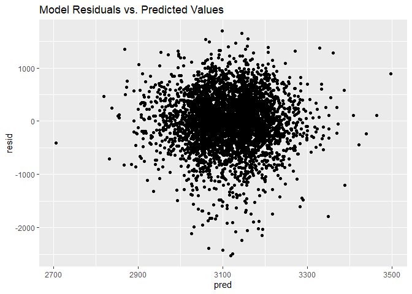

Homework 6
================
Elise Mantell
2019-11-25

### Problem 1

``` r
bw_data = read_csv("./data/birthweight.csv") %>%
janitor::clean_names() %>%
mutate(babysex = as.factor(babysex)) %>%
mutate(frace = as.factor(frace)) %>% 
mutate(mrace = as.factor(mrace)) %>% 
mutate(malform = as.factor(malform)) 
```

##### To build this model, I will start with a few variables that we know generally have an effect on birthweight, including mother’s pre-pregnancy BMI, maternal smoking, and the sex of the baby. I deliberately chose variables that we could have information on prior to birth.

``` r
mine = lm(bwt ~ ppbmi + smoken + babysex, data = bw_data)
```

``` r
mine %>% 
  broom::tidy() %>% 
  select(term, estimate, p.value) %>% 
  knitr::kable(digits = 3)
```

| term        | estimate | p.value |
| :---------- | -------: | ------: |
| (Intercept) | 2854.979 |       0 |
| ppbmi       |   15.110 |       0 |
| smoken      |  \-5.444 |       0 |
| babysex2    | \-90.337 |       0 |

``` r
bw_data %>% 
  modelr::add_residuals(mine) %>% 
  modelr::add_predictions(mine) %>% 
  ggplot(aes(x = pred, y = resid)) + geom_point() + labs(title =   "Model Residuals vs. Predicted Values")
```

<!-- -->

##### Comparing to other models:

  - One using length at birth and gestational age as predictors (main
    effects only)
  - One using head circumference, length, sex, and all interactions
    (including the three-way interaction) between these

<!-- end list -->

``` r
mod_2 = lm(bwt ~ blength + gaweeks, data = bw_data)
mod_3 = lm(bwt ~ bhead + blength + babysex + bhead*blength + bhead*babysex + blength*babysex + blength*babysex*bhead, data = bw_data)
```

``` r
cv_df =
  crossv_mc(bw_data, 100) 

cv_df = 
  cv_df %>% 
  mutate(mine = map(train, ~lm(bwt ~ ppbmi + smoken + babysex, data =.x)),
         mod_2 = map(train, ~lm(bwt ~ blength + gaweeks, data = .x)),
         mod_3  = map(train, ~lm(bwt ~ bhead + blength + babysex +
                              bhead*blength + bhead*babysex + 
                              blength*babysex + blength*babysex*bhead,
                              data = .x))) %>% 
  mutate(rmse_mine = map2_dbl(mine, test, ~rmse(model = .x, data = .y)),
         rmse_2 = map2_dbl(mod_2, test, ~rmse(model = .x, data = .y)),
         rmse_3 = map2_dbl(mod_3, test, ~rmse(model = .x, data = .y)))
```

``` r
cv_df %>% 
  select(starts_with("rmse")) %>% 
pivot_longer(
    everything(),
    names_to = "model", 
    values_to = "rmse",
    names_prefix = "rmse_") %>% 
  mutate(model = fct_inorder(model)) %>% 
  ggplot(aes(x = model, y = rmse)) + geom_violin()
```

<!-- -->

##### The best model appears to be model 3 (head circumference, length, sex, and all interactions), and the worst is mine (only including variables available prior to birth).
